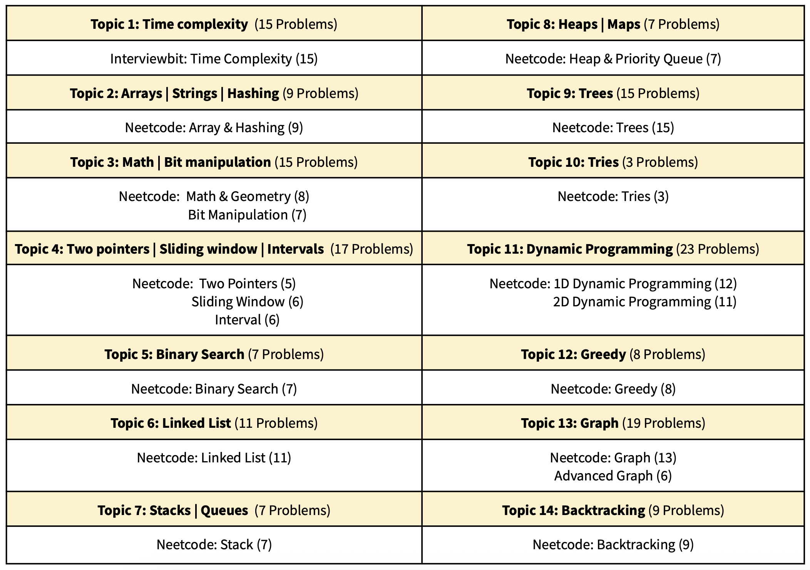

## DSA Roadmap

1. **Topic Wise Practice [Neetcode 150](https://neetcode.io/practice)**
   - Choose one topic (i.e Graphs, Trees, etc...) and review its theory  
   - Complete **all** problems for that topic from Neetcode 150
   - Simultaneously, tackle LeetCode’s daily challenge to build consistency  

2. **Mixed Practice [Neetcode 150 Shuffled](https://docs.google.com/spreadsheets/d/1pl5ksbZ8HNdwEN3_aqwx5eCmUkA9snM2xGZLaIN_jXI/edit?usp=sharing)** 
   - Solve Neetcode 150 problems in a shuffled order to reinforce adaptability and recall  

